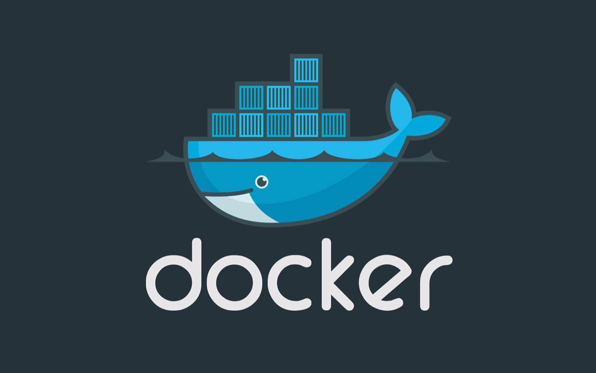

# Docker

`Docker` 学习过程中文档记录

`[ 1 ]` [` 01-安装 Vim `](./src/01-安装%20Vim.md)

`[ 2 ]` [` 02-安装 Mysql `](./src/02-安装%20Mysql.md)

`[ 3 ]` [` 03-安装 Minio `](./src/03-安装%20Minio.md)

`[ 4 ]` [` 04-logs 命令 `](./src/04-logs%20命令.md)

`[ 5 ]` [` 05-导出导入 `](./src/05-导出导入.md)

`[ 6 ]` [` 06-删除容器 `](./src/06-删除容器.md)

