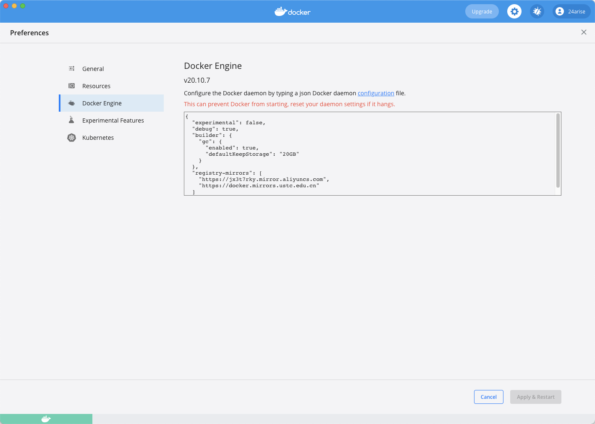

# 安装 Mysql

## 1、配置



> 其中 `aliyuncs` 为 阿里云 的镜像加速器，可参考如下
>
> **使用镜像加速器**
>
> 在不同的操作系统下，配置加速器的方式略有不同，下文将介绍主要操作系统的配置方法。
>
> 关于加速器的地址，您登录 [容器镜像服务控制台](https://cr.console.aliyun.com/) 后，在左侧导航栏选择 ***镜像工具 > 镜像加速器***，在 ***镜像加速器*** 页面就会显示为您独立分配的加速器地址。
>
> ```bash
> 例如：
> 加速器地址：`[系统分配前缀].mirror.aliyuncs.com`
> ```

```json
{
  "experimental": false,
  "debug": true,
  "builder": {
    "gc": {
      "enabled": true,
      "defaultKeepStorage": "20GB"
    }
  },
  "registry-mirrors": [
    "https://jx3t7rky.mirror.aliyuncs.com",
    "https://docker.mirrors.ustc.edu.cn"
  ]
}
```


## 2、安装

> 查找镜像
>
> `docker images`

```bash
🔥 ~ docker images
REPOSITORY               TAG       IMAGE ID       CREATED        SIZE
docker/getting-started   latest    083d7564d904   4 weeks ago    28MB
alpine/git               latest    b8f176fa3f0d   7 weeks ago    25.1MB
jetbrains/qodana         latest    ce3d3761a7fe   6 months ago   2.21GB
🔥 ~ 
```

> 搜索 `mysql`
>
> `docker search mysql`

```bash
🔥 ~ docker search mysql
NAME                              DESCRIPTION                                     STARS     OFFICIAL   AUTOMATED
mysql                             MySQL is a widely used, open-source relation…   11113     [OK]
mariadb                           MariaDB Server is a high performing open sou…   4213      [OK]
mysql/mysql-server                Optimized MySQL Server Docker images. Create…   825                  [OK]
mysql/mysql-cluster               Experimental MySQL Cluster Docker images. Cr…   88
centos/mysql-57-centos7           MySQL 5.7 SQL database server                   88
centurylink/mysql                 Image containing mysql. Optimized to be link…   59                   [OK]
databack/mysql-backup             Back up mysql databases to... anywhere!         44
deitch/mysql-backup               REPLACED! Please use http://hub.docker.com/r…   41                   [OK]
prom/mysqld-exporter                                                              39                   [OK]
tutum/mysql                       Base docker image to run a MySQL database se…   35
linuxserver/mysql                 A Mysql container, brought to you by LinuxSe…   30
schickling/mysql-backup-s3        Backup MySQL to S3 (supports periodic backup…   29                   [OK]
mysql/mysql-router                MySQL Router provides transparent routing be…   21
centos/mysql-56-centos7           MySQL 5.6 SQL database server                   20
arey/mysql-client                 Run a MySQL client from a docker container      17                   [OK]
fradelg/mysql-cron-backup         MySQL/MariaDB database backup using cron tas…   15                   [OK]
yloeffler/mysql-backup            This image runs mysqldump to backup data usi…   7                    [OK]
genschsa/mysql-employees          MySQL Employee Sample Database                  7                    [OK]
openshift/mysql-55-centos7        DEPRECATED: A Centos7 based MySQL v5.5 image…   6
cytopia/mysql-5.5                 MySQL 5.5 on CentOS 7                           4                    [OK]
devilbox/mysql                    Retagged MySQL, MariaDB and PerconaDB offici…   3
ansibleplaybookbundle/mysql-apb   An APB which deploys RHSCL MySQL                2                    [OK]
widdpim/mysql-client              Dockerized MySQL Client (5.7) including Curl…   1                    [OK]
jelastic/mysql                    An image of the MySQL database server mainta…   1
monasca/mysql-init                A minimal decoupled init container for mysql    0
🔥 ~ 
```

> 拉取 `mysql` 「*Tips：本次以以 `5.7` 版本示例*」
>
> `docker pull mysql:5.7`
>
> 执行完成后，`docker images` 可看到 `mysql` 已在镜像列表中

```bash
🔥 ~ docker pull mysql:5.7
5.7: Pulling from library/mysql
b4d181a07f80: Pull complete
a462b60610f5: Pull complete
578fafb77ab8: Pull complete
524046006037: Pull complete
d0cbe54c8855: Pull complete
aa18e05cc46d: Pull complete
32ca814c833f: Pull complete
52645b4af634: Pull complete
bca6a5b14385: Pull complete
309f36297c75: Pull complete
7d75cacde0f8: Pull complete
Digest: sha256:1a2f9cd257e75cc80e9118b303d1648366bc2049101449bf2c8d82b022ea86b7
Status: Downloaded newer image for mysql:5.7
docker.io/library/mysql:5.7
🔥 ~ docker images
REPOSITORY               TAG       IMAGE ID       CREATED        SIZE
mysql                    5.7       09361feeb475   3 weeks ago    447MB
docker/getting-started   latest    083d7564d904   4 weeks ago    28MB
alpine/git               latest    b8f176fa3f0d   7 weeks ago    25.1MB
jetbrains/qodana         latest    ce3d3761a7fe   6 months ago   2.21GB
🔥 ~ 
```


## 3、启动

> `docker run --name mysql -p 3306:3306 -e MYSQL_ROOT_PASSWORD=root -d mysql:5.7`
>
> *参数说明*
>
> - `docker run`：运行 docker 容器命令
> - `--name mysql`：给容器设置别名
> - `-p 3306:3306`：将容器的 `3306` 端口映射到宿主机的 `3306` 端口
> - `-e MYSQL_ROOT_PASSWORD`：初始化 `root` 用户登陆密码
> - `-d`：后台运行容器，并返回容器`id`
> - `mysql:5.7`：也可使用镜像 `id` ，即 `docker images` 中的 `IMAGE ID`

```bash
🔥 ~ docker run --name mysql -p 3306:3306 -e MYSQL_ROOT_PASSWORD=root -d mysql:5.7
c8859add45a910ecf2388927317137dc65b695b4fc823066117a238225fbd951
🔥 ~ 
```


## 4、查看运行中的容器

> `docker ps`
>
> 有 `mysql`，说明 `mysql` 已经启动成功

```bash
🔥 ~ docker ps
CONTAINER ID   IMAGE       COMMAND                  CREATED         STATUS         PORTS                                                  NAMES
c8859add45a9   mysql:5.7   "docker-entrypoint.s…"   7 minutes ago   Up 7 minutes   0.0.0.0:3306->3306/tcp, :::3306->3306/tcp, 33060/tcp   mysql
🔥 ~ 
```


## 5、进入 `Mysql` 容器

> `docker exec -it mysql /bin/bash`

```bash
🔥 ~ docker exec -it mysql /bin/bash
root@c8859add45a9:/#
```


## 6、登陆 `Mysql`

> `mysql -u root -p`

```base
root@c8859add45a9:/# mysql -u root -p
Enter password:
Welcome to the MySQL monitor.  Commands end with ; or \g.
Your MySQL connection id is 2
Server version: 5.7.34 MySQL Community Server (GPL)

Copyright (c) 2000, 2021, Oracle and/or its affiliates.

Oracle is a registered trademark of Oracle Corporation and/or its
affiliates. Other names may be trademarks of their respective
owners.

Type 'help;' or '\h' for help. Type '\c' to clear the current input statement.

mysql> show databases;
+--------------------+
| Database           |
+--------------------+
| information_schema |
| mysql              |
| performance_schema |
| sys                |
+--------------------+
4 rows in set (0.00 sec)

mysql>
```


## 7、设置大小写不敏感

> 查看系统文件及表名的大小写设置
>
> `show variables like '%lower_case%'`
>
> *参数说明*
>
> - `lower_case_table_names = 0`   区分大小写
> - `lower_case_table_names = 1`   不区分大小写
>
> *Mysql 在 Linux下的数据库名、表名、列名、别名大小写规则*
>
> - 数据库名与表名是严格区分大小写的
>
> - 表的别名是严格区分大小写的
>
> - 列名与列的别名在所有的情况下均是忽略大小写的
>
> - 变量名也是严格区分大小写的
>
> *Mysql 在 Windows下都不区分大小写*

```bash
mysql> show variables like '%lower_case%';
+------------------------+-------+
| Variable_name          | Value |
+------------------------+-------+
| lower_case_file_system | OFF   |
| lower_case_table_names | 0     |
+------------------------+-------+
2 rows in set (0.00 sec)

mysql>
```

>调整配置文件
>
>「*Tips：*
>
>*1、容器中若未安装 `vim`，可先安装，参考 [`Docker 安装 Vim`](../Vim)*<br/>
>
>*2、设置完后实际使用时一定要先将当前的数据库名和表名转换为小写，不然会报找不到表的错误；所谓的大小写不敏感，实际上是先把`sql`统一转换成了小写来查询*
>
> 」
>
>`vim /etc/mysql/mysql.conf.d/mysqld.cnf`
>
>设置不区分大小写
>
>`lower_case_table_names=1`
>
>重启 `Mysql`
>
>`docker restart mysql`

```
root@c8859add45a9:/# vim /etc/mysql/mysql.conf.d/mysqld.cnf
# Copyright (c) 2014, 2021, Oracle and/or its affiliates.
#
# This program is free software; you can redistribute it and/or modify
# it under the terms of the GNU General Public License, version 2.0,
# as published by the Free Software Foundation.
#
# This program is also distributed with certain software (including
# but not limited to OpenSSL) that is licensed under separate terms,
# as designated in a particular file or component or in included license
# documentation.  The authors of MySQL hereby grant you an additional
# permission to link the program and your derivative works with the
# separately licensed software that they have included with MySQL.
#
# This program is distributed in the hope that it will be useful,
# but WITHOUT ANY WARRANTY; without even the implied warranty of
# MERCHANTABILITY or FITNESS FOR A PARTICULAR PURPOSE.  See the
# GNU General Public License, version 2.0, for more details.
#
# You should have received a copy of the GNU General Public License
# along with this program; if not, write to the Free Software
# Foundation, Inc., 51 Franklin St, Fifth Floor, Boston, MA  02110-1301 USA

#
# The MySQL  Server configuration file.
#
# For explanations see
# http://dev.mysql.com/doc/mysql/en/server-system-variables.html

[mysqld]
pid-file	= /var/run/mysqld/mysqld.pid
socket		= /var/run/mysqld/mysqld.sock
datadir		= /var/lib/mysql
#log-error	= /var/log/mysql/error.log
# By default we only accept connections from localhost
#bind-address	= 127.0.0.1
# Disabling symbolic-links is recommended to prevent assorted security risks
symbolic-links=0
lower_case_table_names=1
root@c8859add45a9:/#
```

> 重启 `Mysql`
>
> `docker restart mysql`

```
🔥 ~ docker restart mysql
mysql
🔥 ~ 
```


